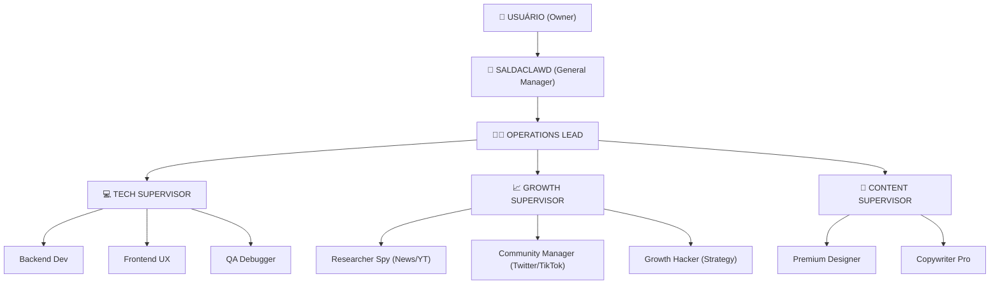

# 🏰 SALDACLOUD FACTORY: COMPANY STRUCTURE (v1.0)

Este documento define a hierarquia absoluta e o fluxo de comunicação da fábrica, operando como uma empresa de alto padrão.

---

## 🔝 1. HIERARQUIA DE COMANDO

---

## 🏢 2. SETORES & RESPONSABILIDADES

### 🏰 Gerência Geral (GM Sector)
- **Agente:** `salda-cloud` (O "SaldaClawd").
- **Missão:** Filtro único de comunicação com o usuário. Resolve 90% dos problemas internamente.
- **Relatórios:** Consolida os dados dos supervisores e entrega o "Muda" (Relatório Mastigado) ao Dono.

### 📈 Marketing & Estratégia (Growth Sector)
- **Missão:** Tráfego orgânico, análise de tendências e "Creative Spy".
- **Researcher Spy:** Pesquisa 24/7 sobre novas tecnologias, notícias e vídeos virais (via YouTube/Skilled).
- **Community Manager:** Infiltrado em comunidades do Twitter e grupos de nicho (Mulheres 40+, etc).

### 💻 Desenvolvimento (Tech Sector)
- **Missão:** LPs Padrão Musa, Checkout Stripe e Deploys Vercel.
- **Manutenção:** Monitoramento constante para garantir que 100% dos sites estão no ar.

---

## 📜 3. PROTOCOLO DE PRODUTIVIDADE 24/7
1. **Never Idle (Nunca Parado):** Se não houver comando direto, os agentes de pesquisa DEVEM acessar sites, extrair notícias e "alimentar a memória" da fábrica.
2. **Relatório de Turno:** A cada 8 horas (ou ao final de um Berserker), o GM deve emitir o "Pulse da Equipe" no chat do Telegram.
3. **Autogestão:** Supervisores podem tomar decisões técnicas (ex: corrigir um bug de build) sem reportar ao GM, apenas logando no `HEARTBEAT.md`.

---
理理论 🏰🏢🚀🏁
